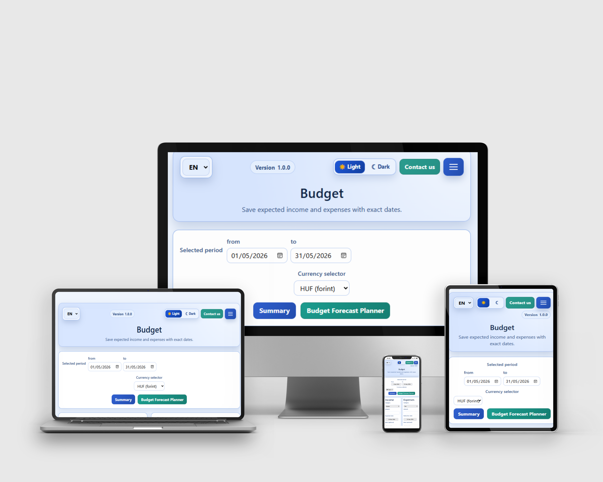
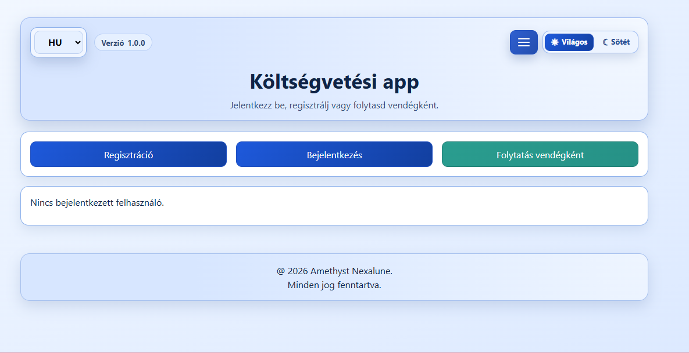
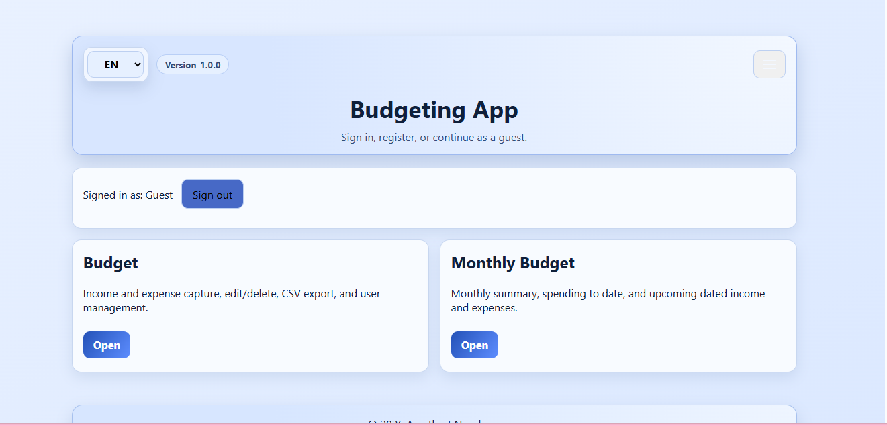
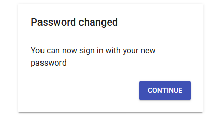
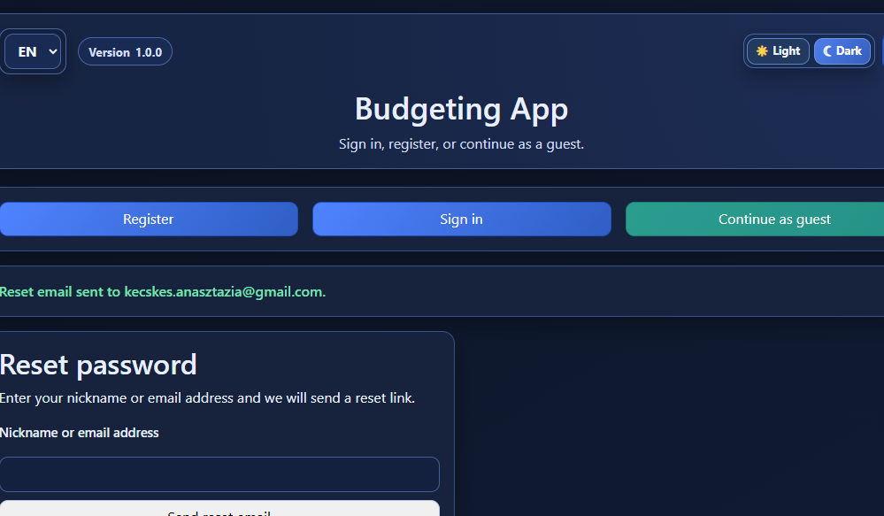
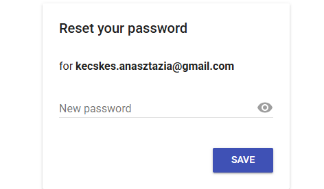

# Budgeting App

## Live Demo  

👉 [Click here to open the live project](https://anasztazia12.github.io/budgeting/)

Responsive design



This is my budgeting app project.

The goal was to build a simple and clear money-tracking web app that works in both Hungarian and English.

It is still evolving, but I have already added many UX improvements recently, including mobile usability updates.

## Overview

This app was created to solve a very common everyday problem: many people know their monthly income and regular bills, but it is still hard to see the real financial situation for a selected period.

In practice, money planning is often not only about fixed costs. Unexpected expenses can appear (for example car repair), and extra income can also happen (for example overtime payment). Without a simple planning tool, it is difficult to estimate how these changes affect the period balance.

The main goal of this project is to make personal budgeting more transparent and easier to plan ahead:

- track income and expenses in one place
- keep data readable by date and category
- calculate totals for a selected period
- test what-if scenarios before making decisions

The forecast part is especially important in this project. It lets the user simulate "what happens if..." cases, such as:

- "What if I need to pay for a car repair this month?"
- "What if I get extra overtime income this month?"

Based on these extra planned items, the app recalculates expected results for the selected period, so the user can decide earlier and plan more safely.

## Key features

- registration / login / guest mode
- income and expense tracking
- edit and delete entries
- date range filtering
- forecast page with what-if rows
- monthly summary page
- light/dark theme switch
- HU/EN language switch
- PWA install support

## Main pages

- `index.html` - start page (auth, language, theme, menu)
- `budget.html` - main budgeting page (CRUD + stats + lists)
- `budget-forecast.html` - forecast planner
- `monthly_budget.html` - monthly summary

## Tech stack

- HTML, CSS, Vanilla JS
- Firebase Auth
- Firestore
- localStorage / sessionStorage
- Service Worker + manifest (PWA)
- local run with Node server

## Registration and data saving

Registration flow in short:

1. User fills in registration fields.
2. Firebase Auth creates the account.
3. A user document is created in Firestore (`users/{uid}`), where app-related user data is stored.
4. Session and some UI preferences are also stored locally so page refresh does not lose state.

Important notes:

- in guest mode, data is stored separately
- for logged-in users, Firestore is the main data source

## Data storage (what goes where)

### Firestore

Mainly user-specific data:

- budget entries
- profile data
- password history related fields (if enabled)

### localStorage / sessionStorage

UI and session-related values, for example:

- language
- theme
- currency
- current session info
- install status
- guest data
- forecast scenario cache (scoped per user)

## Firestore backup

Firestore backup is supported.

What is most important to back up:

- `users` collection (highest priority)
- username mapping and helper collections (if used)

Practical backup options:

1. Firebase Console export (good for manual backup)
2. Scheduled export to GCP bucket (better for production)
3. Periodic JSON export script (simple setups)

For restore, pay attention to:

- schema changes
- old/new field compatibility
- keeping Auth and Firestore data consistent

## UX 5 Plan (simple practical version)

This is how I use the 5-plane UX model during development.

### 1) Strategy (why)

Main problem I want to solve:

- users can add data, but they still do not clearly see how their money situation changes in a period

Main goals:

- make money input fast
- let users start in 1-2 minutes
- keep daily usage comfortable on mobile too
- reduce mistakes during edit/delete actions

How I check if this works:

- new user can create first entry quickly
- user can understand totals without extra explanation
- user gets clear feedback after each important action

### 2) Scope (what)

Included now:

- auth flow
- budget CRUD
- forecast
- summary
- HU/EN
- PWA install
- recurring entries
- date filters for list and period

Not included now:

- bank import
- advanced charting system
- full multi-device sync for all edge cases

Why this scope:

- I focused first on core daily budgeting actions
- I postponed advanced features so the base flow can stay stable and easy

### 3) Structure (how it works)

- index: entry + basic settings
- budget: day-to-day usage
- forecast: planning
- summary: quick check

Main rules:

- after edit click, jump to the input field
- delete should use in-app confirmation, not browser native confirm
- important actions should always show feedback

Main user flow I design for:

1. user signs in or continues as guest
2. user adds income and expenses
3. user reviews totals and list
4. user opens forecast for "what if" simulation
5. user adjusts plan for selected period

Navigation idea:

- each page has a clear role
- menu labels should be consistent in HU and EN
- user should not feel lost when switching pages

### 4) Skeleton (layout)

- controls at the top
- forms below
- stats next to/below forms
- lists at the bottom

Form behavior details:

- labels and input order should stay predictable
- edit mode should be clearly visible (updated button labels)
- delete action should be close to the selected item

On mobile:

- buttons must be easy to tap
- edit/delete controls must stay visible
- delete confirmation should appear in a visible safe place

List behavior details:

- each row should quickly show category, date, amount, and note
- recurring state should be visible (badge + toggle)
- actions should remain usable even on small screens

### 5) Surface (look and microcopy)

- clear and high-contrast UI
- destructive action (delete) should stand out
- short understandable messages in HU and EN

Microcopy style I follow:

- short action-based texts (Save, Delete, Cancel)
- plain language instead of technical wording
- same meaning in both languages, not literal-only translation

Visual consistency checklist:

- similar button style for similar action type
- danger color only for destructive actions
- readable spacing and text size on mobile and desktop

### Practical UX checks before release

- add/edit/delete works on desktop and mobile
- no dead clicks in main flow
- forecast update is visible after each what-if change
- HU/EN labels are consistent on all main pages

## Run locally

Node is required.

```bash
npm start
```

Usually available at:

- `http://localhost:3000`

If this does not work, you can also run with a simple local static server.

## Testing (manual)

Currently I test mostly manually.

### Test types

| Test type | What I check | When |
| --- | --- | --- |
| Smoke test | App opens, navigation works, no crash | Every change |
| Functional test | CRUD, summary, forecast, export | Feature changes |
| i18n check | HU/EN labels and menu consistency | Text/UI changes |
| Responsive check | Mobile and desktop layout sanity | Before release |
| Offline/PWA check | Cached startup behavior | Before release |

### Browser matrix (recommended)

| Browser | Desktop | Mobile |
| --- | --- | --- |
| Chrome | Yes | Yes |
| Edge | Yes | Optional |
| Firefox | Yes | Optional |
| Safari | Optional | Yes |
| Samsung Internet | Optional | Yes |

### Manual test list

#### Authentication

| ID | Test step | Expected |
| --- | --- | --- |
| AUTH-01 | Register with valid values | Success + user saved |
| AUTH-02 | Register with mismatched email | Validation message |
| AUTH-03 | Login with correct credentials | Session active |
| AUTH-04 | Login with wrong password | Error message |
| AUTH-05 | Continue as guest | Guest session active |
| AUTH-06 | Logout from menu | Session cleared |
| AUTH-07 | Change password with new value | Password updated |
| AUTH-08 | Change password with previously used value | Rejected with message |
| AUTH-09 | Reset password from email link with new value | Password reset works |
| AUTH-10 | Reset password from email link with old value | Rejected with message |

#### Budget CRUD and recurring

| ID | Test step | Expected |
| --- | --- | --- |
| BUD-01 | Add income | Appears in list and totals update |
| BUD-02 | Add expense | Appears in list and totals update |
| BUD-03 | Edit entry | New values visible |
| BUD-04 | Delete entry | Removed and totals recalculated |
| BUD-05 | Toggle recurring | Badge/action state updates |
| BUD-06 | Filter by date range | Only matching entries shown |

#### Forecast and summary

| ID | Test step | Expected |
| --- | --- | --- |
| FC-01 | Set target date | Forecast values recalc |
| FC-02 | Add extra expense row | Simulated balance decreases |
| FC-03 | Add extra income row | Simulated balance increases |
| FC-04 | Remove what-if row | Forecast updates correctly |
| SUM-01 | Open summary page | Cards show period totals |
| SUM-02 | Change period | Summary values refresh |

#### Language consistency

| ID | Test step | Expected |
| --- | --- | --- |
| I18N-01 | Switch HU -> EN on all pages | Labels translated everywhere |
| I18N-02 | Check summary wording in menu | HU/EN wording is correct |
| I18N-03 | Check forecast EN wording | Natural and consistent labels |
| I18N-04 | Check fallback text before JS loads | Same meaning as final UI |

### Quick minimum checks before release

- auth works
- add/edit/delete works
- recurring logic is correct
- forecast calculation is correct
- HU/EN labels stay consistent
- mobile layout is usable
- PWA install button gives meaningful response

## Known limitations

- no full automated test suite yet
- if browser storage is cleared, some local data can be lost
- backup/restore flow can still be improved

## Screenshots





### Password change/reset screenshots





## Note

This project is still evolving, so there is room for polishing.
The main workflows are now stable, and mobile usage is much better than before.

## Thank you for reading

Thank you for taking the time to review my project.  
I hope you found it clear and useful.  
If you have any questions or feedback, feel free to contact me.
