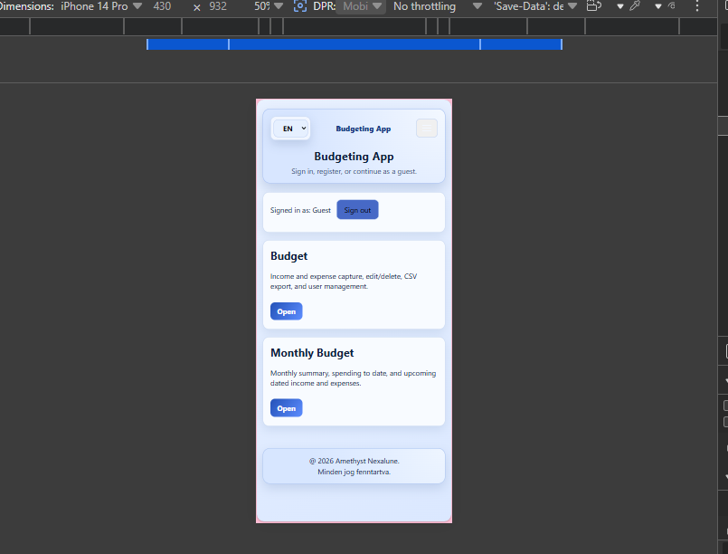
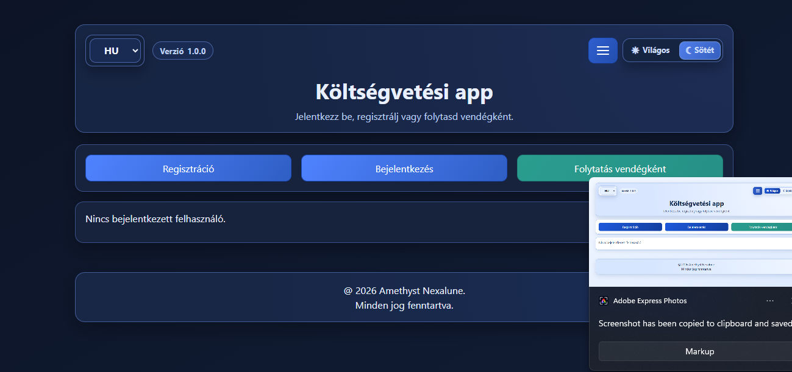

# Budgeting App

A lightweight, browser-based budgeting app with HU/EN UI, local accounts, and monthly planning tools.

## Overview

Budgeting App is designed for people who want a practical monthly finance workflow without spreadsheets or complex setup. The app focuses on daily usability: quick entry creation, clear status indicators, and short-term projection support. Instead of forcing long onboarding, it allows immediate use through either registered accounts or guest mode.

The product emphasizes clarity and speed:

- One place for income and expense tracking
- Fast visibility of monthly totals and balance trends
- Forecasting support for expected end-of-period outcome
- Responsive usage across laptop and phone screens
- Bilingual UI (Hungarian and English) with consistent terminology

Because the project is client-side, users can run it locally and keep control over their own data environment. This also means the current version is optimized for single-device usage, with no backend dependency.

## What it does

- Register / sign in / guest mode
- Income and expense tracking
- Monthly summary cards (income, expense, spent-to-date, balance)
- Forecast view and period-based projection
- CSV export
- Responsive UI with PWA support

## Project scope

This project is client-side only.

- Data is stored in localStorage.
- No backend API, no database, no cloud sync.
- Email actions use `mailto:` drafts in the user's default mail app.

## Main pages

- `index.html` - auth entry (register, login, guest)
- `budget.html` - daily budgeting workspace
- `budget-forecast.html` - forecast planner
- `monthly_budget.html` - summary and projection

## User Experience

### Core user flow

1. User opens the app and selects register, sign in, or guest mode.
2. User adds income and expense records with date and category.
3. User monitors monthly cards (income, expense, spent-to-date, balance).
4. User checks forecast and summary pages for planning decisions.
5. User exports data to CSV when needed.

### UX decisions and fixes

| Issue | Fixed in app |
| --- | --- |
| Controls felt crowded on smaller screens | Responsive control layout and compact mobile grouping |
| Currency/date controls appeared oversized | Content-fit sizing and refined spacing in control rows |
| Inconsistent menu labels across pages/languages | Unified i18n labels and aligned navigation naming |
| Projection text showed date automatically | Date appears only when user explicitly selects end date |
| Empty visual card sections caused confusion | Redundant empty card blocks removed from budget flow |

## UX 5 Planes (Jesse James Garrett)

### 1. Strategy Plane

- User goals: track money quickly, avoid overspending, see short-term outlook.
- Product goals: low-friction budgeting flow, bilingual usability, mobile-friendly interaction.

### 2. Scope Plane

- Functional scope: auth flow, CRUD entries, summaries, forecast, CSV export.
- Content scope: clear labels, actionable metrics, concise feedback messages.

### 3. Structure Plane

- Interaction design: linear flow from auth -> budget -> summary/forecast.
- Information architecture: three main work areas (Budget, Forecast, Summary) with hamburger menu navigation.

### 4. Skeleton Plane

- Interface design: card-based layout, grouped controls, clear form hierarchy.
- Navigation design: top hero toolbar + menu panel for cross-page movement.
- Information design: KPI-first display, lists ordered by date relevance.

### 5. Surface Plane

- Visual design: light/dark themes, consistent accent palette, strong contrast.
- Responsive behavior: compact controls on small screens, touch-friendly actions.
- Language polish: HU/EN switching with mirrored terminology.

## Local run

1. Install Node.js.
2. Run `npm start`.
3. Open `http://localhost:3000`.

If Node is unavailable on your machine, fallback local server:

`py -m http.server 3000`

## Screenshots

## Notes

- Data remains on the same browser/device profile.
- Clearing browser storage or removing the app can remove saved data.
